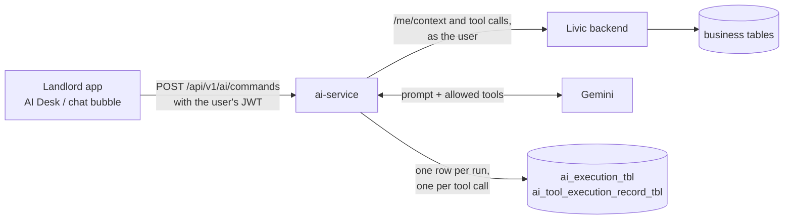

# ai-service

ai-service runs Livic's AI assistant. A landlord asks a question in the app ("Which residents have
overdue payments?"). ai-service gives the model a small set of read-only tools, runs the tool calls
the model asks for against the Livic backend as that landlord, and returns the answer. Every question
and every tool call is recorded.

It is a separate Spring Boot service (Java 21, Spring Boot 4.0.5, Spring AI 2.0.0-M6, Google Gemini).
It is the first slice of [`docs/AI_ARCHITECTURE_DESIGN.md`](../../docs/AI_ARCHITECTURE_DESIGN.md):
read-only, landlords only, one agent, no conversation memory.

## Read these in order

| Doc | What it explains |
|---|---|
| [request-flow.md](request-flow.md) | What happens, step by step, from the app's request to the answer |
| [agent-runtime.md](agent-runtime.md) | Agents, the system prompt and the tool loop with its safety checks |
| [tools.md](tools.md) | The tool contracts, the six tools, and how to add one |
| [llm.md](llm.md) | How ai-service talks to the model, and how to switch providers |
| [data-and-security.md](data-and-security.md) | Login, permissions, the backend client and the audit tables |
| [running-and-testing.md](running-and-testing.md) | Configuration, running it locally, trying it, and the tests |

## The big picture



- **The backend owns all business data and every permission check.** ai-service never reads business
  tables; it calls the backend's normal REST endpoints with the user's own token.
- **Gemini never touches Livic.** It can only ask ai-service to run a tool, and ai-service decides
  whether to.
- **ai-service shares the backend's MySQL database** but uses only its two `ai_*` tables, which the
  backend's Flyway migrations create.

## Code map

```
ai-service/
├── pom.xml                       dependencies (Spring Boot, Spring AI, JPA, jjwt, ArchUnit for tests)
├── Dockerfile
├── docs/                         these docs
└── src/
    ├── main/java/com/livic/ai/
    │   ├── AiServiceApplication.java   entry point
    │   ├── controller/                 HTTP layer
    │   ├── service/                    turns an HTTP request into an agent run
    │   ├── agent/                      who the agent is and who is asking
    │   ├── orchestration/              the tool loop
    │   ├── tools/                      tool contracts and registry
    │   │   └── impl/                   the six tools
    │   ├── llm/                        model contracts (no Spring AI)
    │   │   └── adapter/                the only Spring AI code
    │   ├── client/                     calls to the Livic backend
    │   ├── persistence/                audit entities and repositories
    │   ├── security/                   JWT validation
    │   ├── config/                     Spring configuration and properties
    │   ├── dto/                        request and response bodies
    │   ├── common/response/            the ApiResponse envelope
    │   └── health/                     /health
    ├── main/resources/
    │   ├── application.yml             shared config (+ -dev, -prod profiles)
    │   └── prompts/landlord-assistant.md   the system prompt
    └── test/java/com/livic/ai/         unit and architecture tests
```

### Every class, one line each

| Package | Class | What it does |
|---|---|---|
| (root) | `AiServiceApplication` | Starts the app and registers the `*Properties` records. |
| `controller` | `AIController` | `POST /api/v1/ai/commands`: reads the user from the JWT and hands off to the service. |
| `controller` | `GlobalExceptionHandler` | Turns exceptions into `ApiResponse` errors (400, 401/403/502 for backend failures, 500). |
| `service` | `AICommandService` | Checks AI is enabled, builds the `AgentContext` from `/me/context`, runs the agent, shapes the reply. |
| `agent` | `AgentDefinition` | Blueprint of an agent: id, system prompt, allowed tools, step limit, temperature. |
| `agent` | `LandlordAgentConfig` | Defines the one agent, `landlord-assistant`. |
| `agent` | `AgentContext` | Who is asking: user id, token, request id, and their properties with permission codes. |
| `agent` | `AgentResult` | Outcome of a run: execution id, status, reply, steps, tokens. |
| `agent` | `ExecutionStatus` | `RUNNING`, `COMPLETED`, `FAILED`. |
| `orchestration` | `AgentRuntime` | The loop: asks the model, checks and runs its tool calls, records everything. |
| `tools` | `AiTool` | Interface every tool implements. |
| `tools` | `ToolDefinition` | A tool's name, description, input type, capability and required permission. |
| `tools` | `ToolCapability` | `READ`, `WRITE`, `DESTRUCTIVE`, `EXTERNAL_SIDE_EFFECT`. Only `READ` runs today. |
| `tools` | `ToolExecutionContext` | Who one tool call runs as (user, token, execution, step). |
| `tools` | `ToolResult` | A tool's outcome: `SUCCESS`, `ERROR` or `DENIED`, with a summary and lean data. |
| `tools` | `ToolRegistry` | Collects all tools and filters them per agent and per user. |
| `tools.impl` | `PropertyListTool` | `property_list`: the user's properties. |
| `tools.impl` | `IssueListTool` | `issue_list`: recent maintenance issues with their latest update. |
| `tools.impl` | `IssueGetTool` | `issue_get`: one issue in full, with its timeline. |
| `tools.impl` | `AnalyticsSummaryTool` | `analytics_summary`: rent expected vs collected for a month. |
| `tools.impl` | `AnalyticsDefaultersTool` | `analytics_defaulters`: residents with overdue bills. |
| `tools.impl` | `AnnouncementListTool` | `announcement_list`: recent notices and how many have read them. |
| `tools.impl` | `ToolSupport` | Shared helpers: query params, JSON field reads, page totals, the list shape. |
| `llm` | `LlmGateway` | The runtime's only way to reach a model. |
| `llm` | `ModelRequest` / `ModelResponse` | What goes to the model and what comes back. |
| `llm` | `ModelMessage` | Conversation turns: system prompt, user text, assistant turn, tool results. |
| `llm` | `ToolCall` / `TokenUsage` | A tool call the model asked for; token counts. |
| `llm.adapter` | `SpringAiLlmGateway` | Implements `LlmGateway` with Spring AI's `ChatModel`. |
| `client` | `BackendClient` | GETs from the backend as the user and unwraps the `data` envelope. |
| `client` | `BackendException` | A failed backend call, with a message safe to show. |
| `persistence` | `AgentExecution` + repository | One row per run in `ai_execution_tbl`. |
| `persistence` | `ToolExecutionRecord` + repository | One row per tool call in `ai_tool_execution_record_tbl`. |
| `security` | `JwtAuthenticationFilter` | Reads the Bearer token and sets the signed-in user. |
| `security` | `JwtService` | Verifies the token's signature with the secret shared with the backend. |
| `config` | `SecurityConfig` | Stateless security, CORS, public `/health`, 401 for missing or bad tokens. |
| `config` | `WebClientConfig` | The `WebClient.Builder` used by `BackendClient`. |
| `config` | `AIProperties`, `BackendClientProperties`, `JwtProperties`, `CorsProperties` | Typed `app.*` settings. |
| `dto` | `AICommandDTOs` | `AICommandRequest {message}` and `AICommandResponse {message, executionId, status}`. |
| `common.response` | `ApiResponse` | `{success, data, error}` envelope, the same shape the backend uses. |
| `health` | `HealthController` | `GET /health` returns `OK`. |

## Rules that hold the design together

1. **Only `llm/adapter` imports Spring AI.** Everything else would survive a change of provider or
   library. `ArchitectureTest` fails the build otherwise.
2. **Tools don't orchestrate.** A tool never calls another tool or touches the runtime, persistence or
   model code; `ArchitectureTest` enforces this too.
3. **The model never says who the user is.** User id and token come from the verified JWT; no tool
   takes a user or tenant argument.
4. **The backend has the final say on permissions.** ai-service's filtering only decides what the model
   is offered.
5. **Everything is recorded.** Each run and each tool call, including refused ones, gets a row.
6. **No tools, no model.** A caller who can use none of the agent's tools gets a fixed reply and the
   model is never called, because without tools it invents answers.

## Not built yet

- Conversation memory: each message stands alone.
- Write tools, and the approval step they need (design doc §31 and §54).
- The async path for long runs, more agents and a router, RAG, MCP and model routing.
