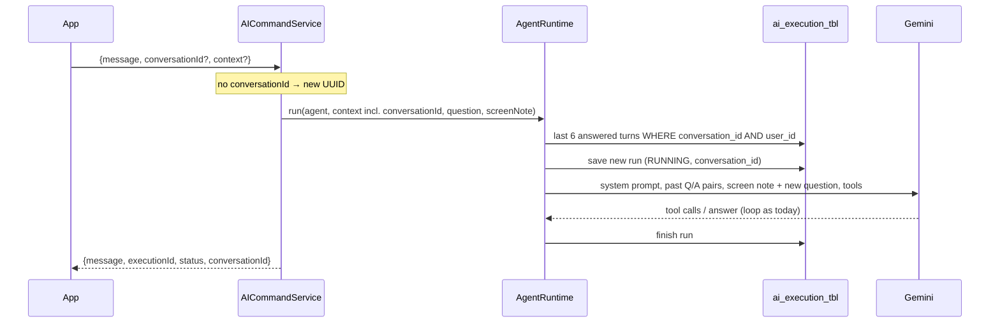

# Plan: conversation memory

Status: **draft for review**, 2026-09-30. Nothing here is built yet.

## Why

The chat looks like a conversation, but each message stands alone. The system prompt even has to
warn the model ("Each message stands alone: you do not see earlier messages"). In testing:

- Asked about "the lift issue", the model asked for a ticket number instead of using the issue it had
  just listed.
- Follow-ups like "what about last month?" or "and the second one?" can't work at all.

Memory is also a prerequisite for the next slice. To confirm "Send reminders to these 2 residents?"
with a "Yes", the service has to remember the previous turn.

## What the user will see

- Follow-up questions work within one chat: "Show open issues" → "Tell me more about the second one"
  → "Who is assigned to it?".
- **Clear chat** on the AI Desk starts a new conversation.
- The floating chat bubble keeps one conversation for as long as its messages are on screen.
- Credits are unchanged: each answered question still costs one.

## Design in one paragraph

Every run already stores the question (`prompt`) and the answer (`final_response`) in
`ai_execution_tbl`, so memory needs **no new table**, just a `conversation_id` on each run. The app
sends the `conversationId` it got back last time. Before calling the model, the runtime loads the last
6 answered turns of that conversation *for that user* and puts them between the system prompt and the
new question. Old tool results are not replayed; if the model needs data again it calls the tool again,
which also keeps figures current.



## Decisions (please review)

| # | Decision | Why | Alternative |
|---|---|---|---|
| 1 | **Store history in `ai_execution_tbl`** (add `conversation_id`), no new table | Question and answer are already stored per run; one source of truth | Design doc §15's `ai_conversation_message_tbl`: a second copy of the same text |
| 2 | **Replay questions and final answers only, not tool results** | Small prompts; the model re-fetches when it needs current data | Replay the last turn's tool results too: fewer tool calls, much larger prompts |
| 3 | **Last 6 answered turns; each past answer cut to 1,500 characters** | Keeps prompts to a few thousand tokens | More turns cost tokens on every question |
| 4 | **The server creates the id**; the app echoes it back | The app can't choose ids | The app generates UUIDs |
| 5 | **History is always filtered by the caller's `user_id`** | Someone else's `conversationId` just yields no history: nothing leaks and no error path is needed | Reject unknown or foreign ids with 404 |
| 6 | **Only answered turns count** (`COMPLETED` with `steps > 0`) | Failed runs, the no-access reply and the out-of-credits reply would only confuse the model | Include everything |
| 7 | **Screen context applies to the current question only**, and is no longer saved inside `prompt` | Old screen blocks would bloat history and describe screens the user has left | Keep saving the combined text |
| 8 | **No time limit on history** | The app's message list decides what a conversation is; the id resets with it | Also ignore turns older than, say, 24 hours |

## Changes

Builds on the AI-credits work (`feat/ai-credits`), which is still uncommitted. Implement after that
lands, on a new branch from `main`.

### Backend migration: `V9__ai_conversation_id.sql`

The number assumes credits' `V8` merges first; renumber if not.

```sql
ALTER TABLE `ai_execution_tbl` ADD COLUMN `conversation_id` varchar(36) NULL AFTER `user_id`;
-- Existing runs become one-turn conversations.
UPDATE `ai_execution_tbl` SET `conversation_id` = `id` WHERE `conversation_id` IS NULL;
ALTER TABLE `ai_execution_tbl` MODIFY `conversation_id` varchar(36) NOT NULL;
CREATE INDEX `idx_ai_execution_conversation` ON `ai_execution_tbl` (`conversation_id`, `user_id`, `created_at`);
```

### ai-service

| File | Change |
|---|---|
| `dto/AICommandDTOs` | Request: optional `UUID conversationId`. Response: `conversationId`. |
| `controller/GlobalExceptionHandler` | Handle `HttpMessageNotReadableException` as **400**. Today a malformed body or bad UUID falls through to the catch-all and returns 500. |
| `agent/AgentContext` | Add `conversationId`, as design doc §3 lists. |
| `service/AICommandService` | Use the request's id or a new UUID. Pass the question and the screen note to the runtime **separately** instead of pre-joining them. Return `conversationId`. Credit logic unchanged. |
| `orchestration/AgentRuntime` | `run(agent, context, question, screenNote)` and `decline(...)` store the raw question plus `conversation_id`. Before the first model call, load history and add each past turn as `UserText` + `AssistantTurn(text, no tool calls)`. The new turn is `UserText(screenNote + question)`. Constants: `HISTORY_TURNS = 6`, `MAX_PAST_ANSWER_CHARS = 1500`. |
| `persistence/AgentExecution` | `conversationId` field; `start(userId, conversationId, agentId, prompt)`. |
| `persistence/AgentExecutionRepository` | `findAnsweredTurns(conversationId, userId, Limit)`: `status = COMPLETED AND steps > 0`, newest first (reversed in the runtime). |
| `resources/prompts/landlord-assistant.md` | Replace the "each message stands alone" line with: earlier questions and answers of this chat come before the new question, and figures in them may be out of date, so call tools again for current data. |

`llm/` and the Spring AI adapter need no change: an assistant turn without tool calls is already
supported.

### Landlord app

| File | Change |
|---|---|
| `features/ai/api/ai.api.ts` | `conversationId?: string` on the request and the response. |
| `features/ai/screens/AIAssistantScreen.tsx` | Hold `conversationId` in state, send it, store the one returned, and reset it in `handleClearChat`. |
| `components/common/navigation/FloatingAIAssistant.tsx` | Same, for as long as the component's message list exists. It has no clear button, so it keeps one conversation per app session. |

The resident app needs nothing: residents get the fixed no-access reply either way.

### Docs

After implementation, update `request-flow.md` (request and response fields), `agent-runtime.md`
(how the conversation is built), `data-and-security.md` (the new column, and ownership via
`user_id`), and remove memory from "Not built yet" in `README.md`.

## Tests

**`AgentRuntimeTest`**
- Past turns sit between the system prompt and the new question, oldest first, as user/assistant
  pairs.
- The history query is called with the caller's `userId` and the `conversationId`.
- Long past answers are cut to the limit.
- The screen note reaches the model but is not saved in `prompt`.
- `decline` saves `conversation_id`.

**`AICommandServiceTest`**
- No id in the request → a new id is generated and returned.
- A given id → passed through and returned.
- Credit tests still pass unchanged.

**Controller slice (new, small)**
- A malformed `conversationId` gets 400, not 500.

**End to end,** on a local backend with a Gemini key (about 15 model calls, so check the quota first):
1. "Show the open maintenance issues", then with the returned id: "Tell me more about the second one".
   Expect `issue_get` for the right issue.
2. "How much rent did we collect this month?", then "And last month?". Expect `analytics_summary` with
   the previous month.
3. Send landlord A's `conversationId` with landlord B's token. B gets an answer with no memory of A.
4. Clear chat, then ask a follow-up. The model doesn't know the earlier topic.
5. `SELECT conversation_id, steps, LEFT(prompt, 40) FROM ai_execution_tbl ORDER BY created_at`. Turns
   share ids, and `prompt` holds only the question.

## Not in this slice

- Listing past conversations or resuming one after the app reloads.
- Summarising long conversations instead of cutting them at 6 turns.
- Deleting history (history is removed with the user, as today).
- Streaming answers.

## Open questions

1. Is 6 turns / 1,500 characters the right window, or do you want more context at a higher token cost?
2. Should the floating chat bubble get a "new chat" button, or is one conversation per app session fine?
3. Any objection to ignoring a foreign `conversationId` silently (decision 5) rather than returning an
   error?
