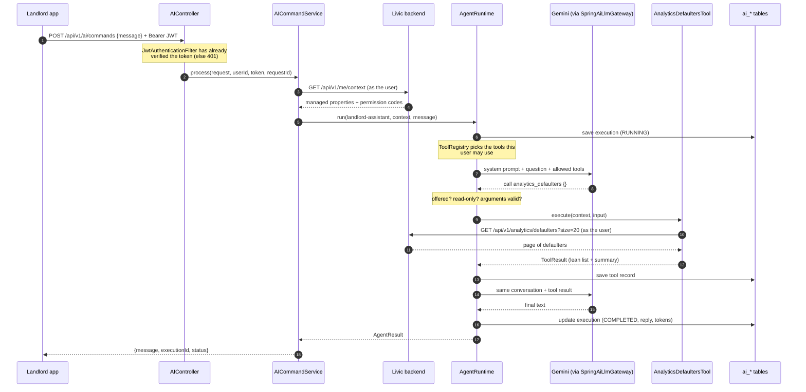

# Request flow

What happens when a landlord asks: *"Which residents have overdue payments?"*



## Step by step

1. **The app sends the question.** Both apps call `POST /api/v1/ai/commands` with
   `{"message": "..."}`, the user's `Authorization: Bearer <JWT>` and an `X-Correlation-Id`
   (`src/features/ai/api/ai.api.ts`, 60-second timeout).
2. **The token is checked.** `JwtAuthenticationFilter` verifies the signature with the secret shared
   with the backend. The user id is the token's `sub`. A missing, bad or expired token gets **401**
   (so the apps refresh and retry). See [data-and-security.md](data-and-security.md).
3. **The request is validated.** `message` must be non-blank and at most 4000 characters, or the reply
   is **400**.
4. **AI must be on.** If `APP_AI_ENABLED` is false, `AICommandService` returns **503**.
5. **ai-service learns who is asking.** It calls the backend's `GET /api/v1/me/context` with the
   user's token and keeps `managedProperties`: each property's id, name and permission codes. This
   becomes the `AgentContext`. Residents have no managed properties.
6. **The runtime starts a run.** `AgentRuntime` saves an `ai_execution_tbl` row with status `RUNNING`.
7. **Tools are chosen.** `ToolRegistry.availableFor` keeps the agent's allowed tools whose required
   permission the user holds on at least one property. If none are left, the run ends here with a
   fixed reply and the model is never called.
8. **The model is asked.** The system prompt (with today's date and the user's property names), the
   question and the allowed tool definitions go to Gemini.
9. **Tool calls are checked, then run.** For each tool call, the runtime checks it was offered and is
   read-only, parses and validates the arguments, and runs the tool. The tool calls the backend as the
   user and returns a short summary plus a lean projection of the data. Each call, even a refused one,
   is saved to `ai_tool_execution_record_tbl`.
10. **Repeat.** The results go back to the model, which either asks for more tools or answers. The loop
    stops at 8 steps.
11. **The run is finished.** The execution row gets its final status, reply, step count, model name and
    token counts, and the reply goes back to the app.

## What the app gets back

Always the `ApiResponse` envelope:

```json
{
  "success": true,
  "data": {
    "message": "No residents have overdue payments.",
    "executionId": "75b30c0c-1194-417b-9f75-86868f6e4e10",
    "status": "COMPLETED"
  },
  "error": null
}
```

`executionId` is the `ai_execution_tbl` row, so any answer can be traced back to its tool calls.

## When things go wrong

| Situation | HTTP | Body |
|---|---|---|
| Missing, bad or expired JWT | 401 | empty |
| Blank or too-long message | 400 | `error: "Validation failed: message: ..."` |
| AI switched off | 503 | `error: "AI service is disabled"` |
| `/me/context` says 401 or 403 | same | the backend's message |
| Backend unreachable or erroring during `/me/context` | 502 | a safe message |
| Model error, provider quota, or step limit reached | 200 | `status: "FAILED"`, a friendly `message`; the cause is in `ai_execution_tbl.error_message` |
| A tool fails (backend 404, timeout...) | 200 | not an error for the app: the model is told and usually explains it |
| Anything unexpected | 500 | `error: "Internal server error"` (no exception text) |

Model failures return 200 on purpose: the app shows `message` as the assistant's reply either way.
